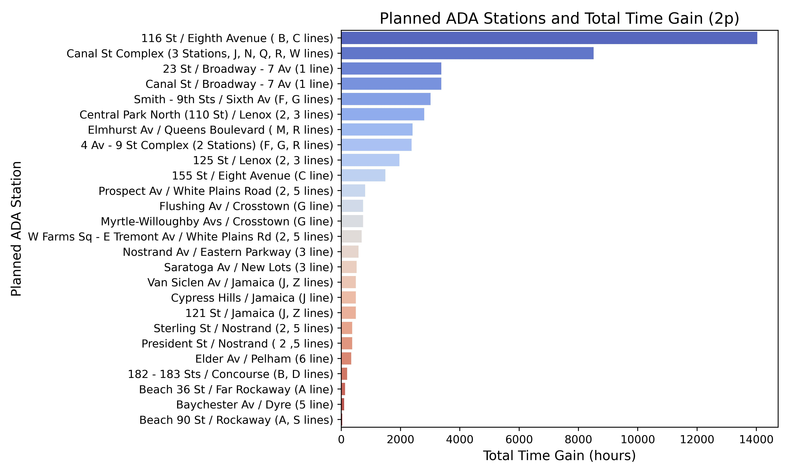

# Mobility-impaired New Yorkers stand to get back 50,000+ hrs per year if the MTA's Capital Plan is successful
This project is for the [MTA Open Data Challenge](https://new.mta.info/article/mta-open-data-challenge). 

The new [2025-2029 Capital Plan](https://future.mta.info/capitalplan/) covers a suite of exciting projects that require funding over the next four years. However, the MTA received a crushing blow to its funding since the New York State Governor unilaterally paused the [MTA's Congestion Pricing plan](https://www.governor.ny.gov/news/what-they-are-saying-governor-hochul-announces-pause-congestion-pricing-address-rising-cost). In order to provide **more political will to support the MTA**, this project quantifies the gains to be made by one of the projects in the Capital Plan, specifically expanded ADA access.  

The Capital Plan outlines a plan to expand ADA access to approximately 30 new stations. While more accessilibity is obviously better, a data-driven estimate of how much time mobility-impaired people (MIP) will "get back" with more access would provide the specificity the MTA might need to secure funding. 

At the outset, we assume that for a mobility-impaired person to reach one of the planned ADA stations (PAS) in the present day, they need to travel to an existing ADA station (EAS) and walk (or power a wheelchair) the rest of the way. After the MTA expands access, they can take the train point-to-point. Therefore, the “time gain” in their future trip is the difference in train time and walking time between one of the nearest existing ADA stations and their “true” intended destination station. 

Based on three datasets: Stations, Origin-Destination 2023, and Hourly Ridership, I estimate that MIP in New York City will save between **50,000+ hrs per year** after the expansion is complete, assuming that *just 2% of MIP rides have a different intended destination*. If we assume that something like 10% of rides had a different intended destination, this number goes up to 250k+ hrs. 

Here's a plot of how much time might be gained for each planned ADA station in priority order: 


Three stakeholder groups can use this analysis: 
1. The MTA - To continue to advocate for funding and secure it for important projects 
2. State politicians - To fight on behalf of mobility-impaired people's equitable transit access
3. Mobility-impaired people - To advocate for their own rights. 

This README is largely for technical documentation. For a more "readable" business case, you can see the deck below: 

## Project Setup and Overview
### Environment Setup
1. Install [Conda](anaconda.org)
2. Run the script below in your terminal from the same directory where `environment.yml` lives. Replace "my_environment_name" with any string you want

```bash
conda env create -f environment.yml -n my_environment_name
```
3. I used VSCode for this project. If you'd like to do the same, you can download it [here](https://code.visualstudio.com/download)
4. Duplicate the `example.env` file and rename to `.env`: 
- Follow the instructions [here](https://support.socrata.com/hc/en-us/articles/115004055807-How-to-Sign-Up-for-a-Tyler-Data-Insights-ID) to get the values for the `NY_OPEN_DATA` variables. 
- Sign up for TravelTime [here](https://account.traveltime.com/login) to get the values for the `TRAVEL_TIME` variables. 
5. Create a file called `src/accessibility_dbt/mta_dev.duckdb`

### Database Setup
1. The first stage of this project requires extracting a bunch of data from the 
[New York Open Data Program](https://data.ny.gov/browse?Dataset-Information_Agency=Metropolitan+Transportation+Authority). The configuration for each of the datasets being extracted lives in `src/database_setup/mta_dataset.py`. The functions in `database_setup.py` use these configurations. 
2. The `database_setup.default_setup` only extracts two days worth of data, but it's fast and good enough to get started with the project. You can look at `notebooks/nb_database_setup.ipynb` to see how to import the module. Simply call `default_setup()` to load your database with the appropriate tables/data. 
3. For the *full* setup you should call `database_setup.year_setup`, which will create the appropriate tables for the full year of 2023. 

## Data Process Overview

After completing the database setup steps, you can navigate to `src/accesssibility_dbt` in your terminal and then execute 

```bash
dbt run
```

[dbt](https://www.getdbt.com) fully handles the transformation layer of the project. dbt does a remarkable job handling documentation for all the data transformations. Rather than reproduce the documentation in this README, I strongly recommend you investigate [my dbt documentation site](https://mta-open-data-challenge.netlify.app/#!/overview). 

This site thoroughly explains all data transformations, and includes *column-level* documentation.  


## Business Process Overview
