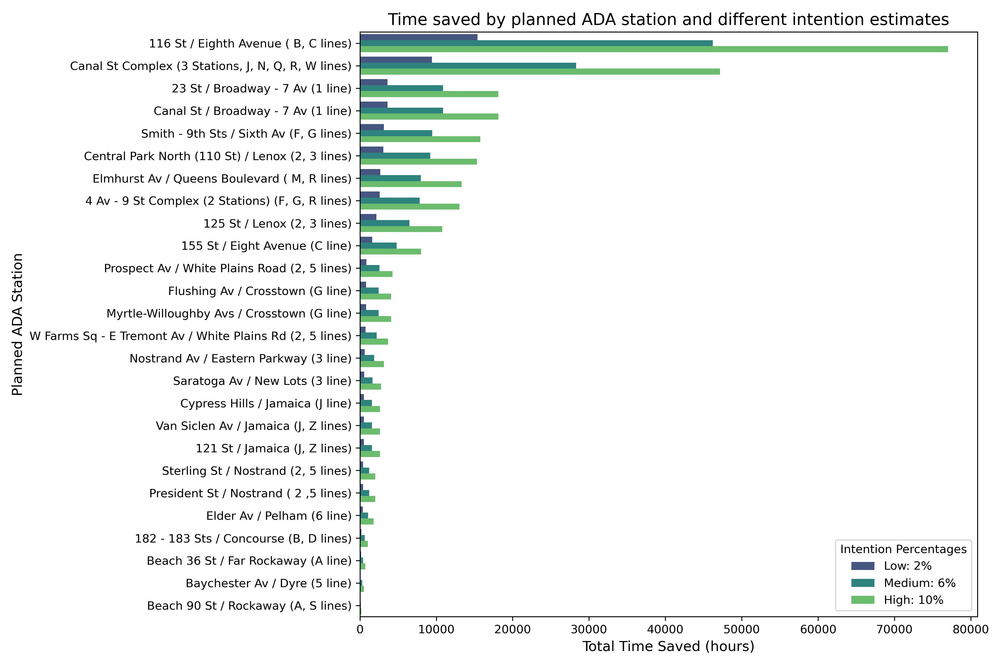
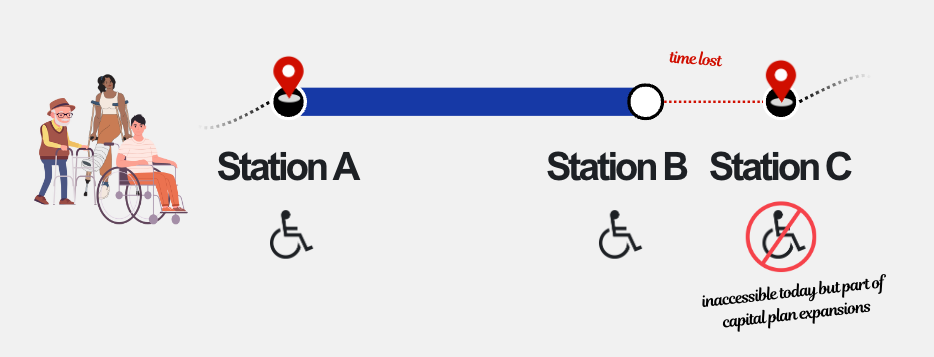
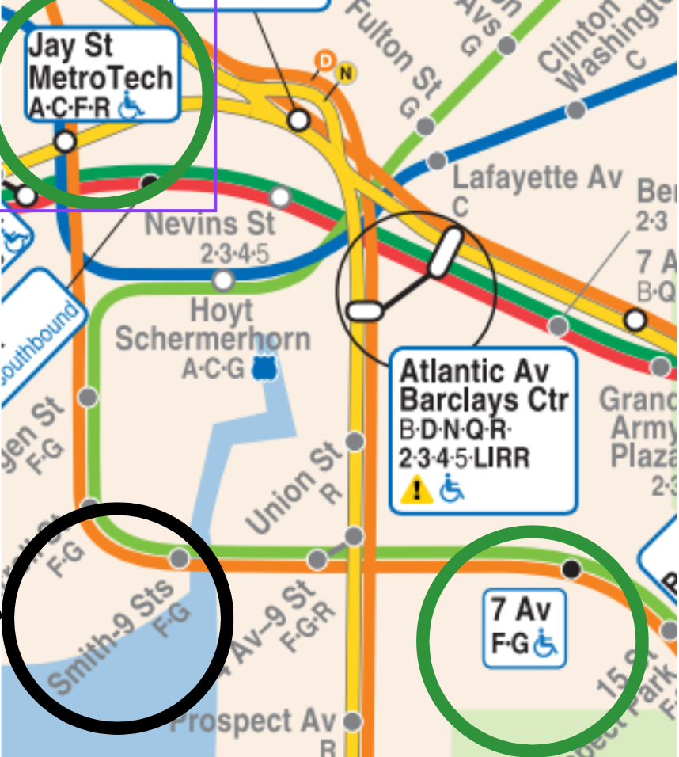
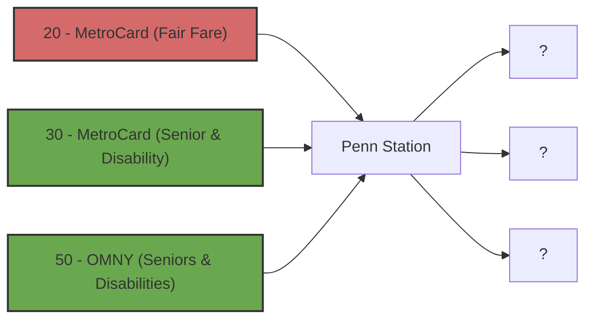
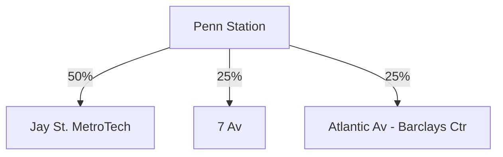
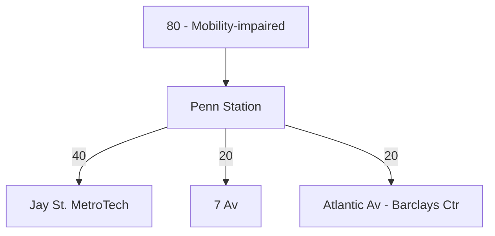
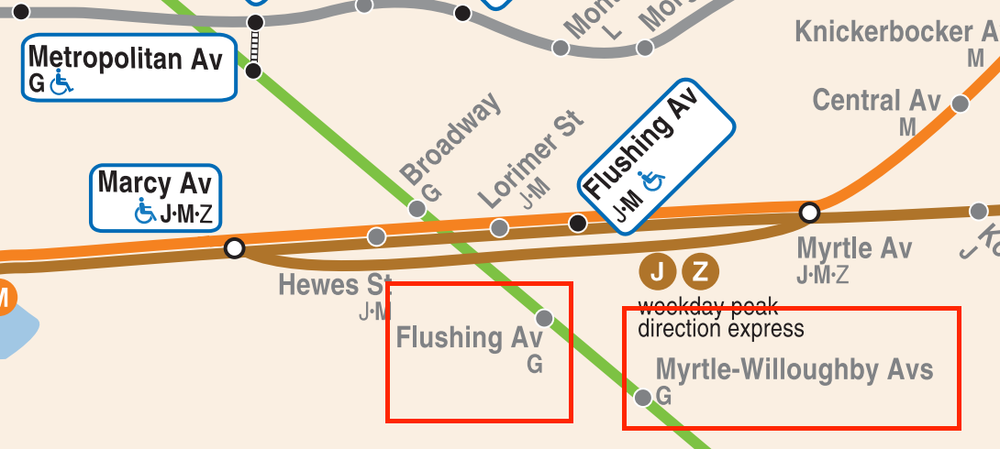

# Mobility-impaired New Yorkers might save 50,000+ hrs per year if the MTA's Capital Plan is successful
This project is for the [MTA Open Data Challenge](https://new.mta.info/article/mta-open-data-challenge). Here's [my official write-up](https://docs.google.com/document/d/1Of3mL7xmEwwwyVqWTdakWQyltum5lsODoW-qkGyhCwI/edit?usp=sharing) for the challenge submission

The 2025-2029 Capital Plan outlines 29 new stations prioritized for accessibility expansion. This is a step in the right direction, but completing this project will require stable funding. Since the Governor paused congestion pricing, several important projects have been suspended. It’s imperative that this doesn’t happen again, especially with the accessibility expansion. This project estimates the hours mobility-impaired New Yorkers will save each year to generate a **persuasive metric for funding advocacy.** 

Three datasets are used int his analysis: [Stations](https://data.ny.gov/Transportation/MTA-Subway-Stations/39hk-dx4f/about_data), [Origin-Destination 2023](https://data.ny.gov/Transportation/MTA-Subway-Origin-Destination-Ridership-Estimate-2/uhf3-t34z/about_data) (last full year of data), and [Hourly Ridership](https://data.ny.gov/Transportation/MTA-Subway-Hourly-Ridership-Beginning-July-2022/wujg-7c2s/about_data). Assuming that just 2% of rides have a "different intended destination", I estimate that mobility-impaired New Yorkers will save a minimum of **50,000+ hrs per year** after the expansion is complete.




For a more "readable" business case, you can see the deck below: 

## Project Setup and Overview
### Environment Setup
1. Install [Conda](anaconda.org)
2. Run the script below in your terminal from the same directory where `environment.yml` lives. Replace "my_environment_name" with any string you want

```bash
conda env create -f environment.yml -n my_environment_name
```
3. I used VSCode for this project. If you'd like to do the same, you can download it [here](https://code.visualstudio.com/download)
4. Duplicate the `example.env` file and rename to `.env`: 
- Follow the instructions [here](https://support.socrata.com/hc/en-us/articles/115004055807-How-to-Sign-Up-for-a-Tyler-Data-Insights-ID) to get the values for the `NY_OPEN_DATA` variables. 
- Sign up for TravelTime [here](https://account.traveltime.com/login) to get the values for the `TRAVEL_TIME` variables. 
5. Create a file called `src/accessibility_dbt/mta_dev.duckdb`

### Database Setup
1. The first stage of this project requires extracting a bunch of data from the 
[New York Open Data Program](https://data.ny.gov/browse?Dataset-Information_Agency=Metropolitan+Transportation+Authority). The configuration for each of the datasets being extracted lives in `src/database_setup/mta_dataset.py`. The functions in `database_setup.py` use these configurations. 
2. The `database_setup.default_setup` only extracts two days worth of data, but it's fast and good enough to get started with the project. You can look at `notebooks/nb_database_setup.ipynb` to see how to import the module. Simply call `default_setup()` to load your database with the appropriate tables/data. 
3. For the *full* setup you should call `database_setup.year_setup`, which will create the appropriate tables for the full year of 2023. 

## Data Transformation 

After completing the database setup steps, you can navigate to `src/accesssibility_dbt` in your terminal and then execute 

```bash
dbt run
```

[dbt](https://www.getdbt.com) fully handles the transformation layer of the project. dbt does a remarkable job handling documentation for all the data transformations. Rather than reproduce the documentation in this README, I strongly recommend you investigate [my dbt documentation site](https://mta-open-data-challenge.netlify.app/#!/overview). 

This site thoroughly explains all data transformations, and includes *column-level* documentation and lineage.  If you prefer, you can also navigate to `src/accessibility_dbt` in your terminal and then run

```bash
dbt docs generate
dbt docs serve
```


## Methodology
#### Terms
- Planned ADA Station (PAS)
- Existing ADA Station (EAS)
- Mobility-impaired people (MIP)

### Mental Model
In the present day, for (MIP) to reach one of the (PAS) using the subway, they will need to take the subway to an (EAS) that is fairly close to their “intended destination” and then walk or power their wheelchair the rest of the way. After accessibility is expanded to the PAS, they can take the subway the whole way (which is obviously faster). Thus, the future “time saved” is the difference between the walking time and train time. 



Using the [MTA Accessibility Map](https://new.mta.info/map/5346), I paired off each PAS listed in the Capital Plan with its nearest EAS. For example, Smith-9 Sts gets paired off with Jay St MetroTech and 7 Av



If we can find the number of mobility-impaired people who end their rides at stations like Jay St MetroTech and 7 Av, along with future time savings between them and the PAS, we can find the number of hours saved per year. 

### Estimating mobility-impaired ridership per station
In order to find rider volume we need to use a combination of the Ridership dataset and Origin-Destination dataset. For this section, let's take the example of Jay St MetroTech. 

The Hourly Ridership dataset tells us the mobility-impaired ridership at *origin* station complexes, but not destination station complexes. Mobility-impaired ridership is defined as `fare_classcategory IN ('MetroCard – Senior & Disability' or  'OMNY – Seniors & Disabilities')`. 


*Example data for 3 AM, on Mondays, in January 2023*

The Origin-Destination dataset tells us origin-destination estimated ridership, but **not** the `fare_class_category`. 


*Example data for 3 AM, on Mondays, in January 2023*

To estimate where the mobility-impaired riders from Hourly Ridership went. We find the general distribution from a source node (like Penn Station) to all possible destination nodes (like Jay St. MetroTech) where **both the source and destination are accessible**. Again, this is the distribution of the general ridership. Then, we assume that the mobility-impaired riders distributed themselves in the *same way*. Therefore, we get something like this: 



We repeat this process for all accessible station complexes to get an estimated mobility-impaired ridership for each accessible destination station. Importantly, we **filter to only stations like Jay St. MetroTech**, or stations that are close enough to the planned ADA stations to be reasonable candidates for walking to the intended destination. 

### Finding the travel time
A particular destination station might be a candidate for walking to *multiple* planned ADA stations. For example, Metropolitan Av. is a candidate to walk to both Flushing Av and Myrtle-Willoughby Avs, which are both "planned ADA stations". 



We use the TravelTime API to find the *train time* and *walking time* from Metropolitan Av to both Flushing Av and Myrtle-Willoughby Avs, and then average the differences. For example:

| `existing_ada_station`| `planned_ada_station` | `walking_time_sec` | `train_time_sec` | `time_difference` |
|-----------------------|-----------------------|--------------------|------------------|-------------------|
| Metropolitan Av/Lorimer St (G)      | Flushing Av / Crosstown (G line)              | 1419           | 751             | 668             |
| Metropolitan Av/Lorimer St (G)      | Myrtle-Willoughby Avs / Crosstown (G line)    | 1932           | 689             | 1243            |

Then we would do:

$$
\frac{1243 + 668}{2} = 955.5
$$

In other words, to get to planned_ada_stations from Metropolitan Av, we will save on average 955.5 sec once accessibility has been expanded. 

### Putting it all together
Now we have both sides of the story. We have the total mobility-impaired ridership to all possible existing ADA stations (that are close enough to planned ADA stations). We also have the average time-savings to get from each exisisting ADA stations to its closest planned ADA stations. **Multiplying these two numbers gives us the total time-savings**. 

However, there's one more step. We cannot take this number at face-value. Doing so would imply that *all* rides to the existing ADA stations had a "different intended destination". This is a poor assumption. Unfortunately, I could not find survey data to suggest what the true rate of "different intended destination" actually is. 

I did my analysis at three levels (low - 2%, medium - 6%, high - 10%). Then, I pivoted the information, putting it into the "planned ADA station" context instead of the "existing ADA station context". This yields the following graph, which shows the potential time-savings for each of the planned ADA stations:


### Assumptions and constraints

- Mobility-impaired people only travel between accessible stations
- Mobility-impaired people distribute themselves to destination stations in the same way as the general ridership
- There exists no good way to estimate how many rides have a “different intended destination”. Conservatively, I estimate somewhere in the ballpark of 2%-10%.
- Mobility-impaired people exit at nearest accessible stations and then travel by road
- Mobility-impaired people walk ~35% slower than unimpaired people
- The accessible stations that I chose from the map are reasonable exit points 
- The TravelTime API gives reasonably correct walking times and train times
- If a planned ADA station’s closest EAS in one of the directions is at an endpoint of the subway line, there is no point getting on the subway at all. 
- A station complex is considered accessible if at least one of its component stations has `ada = 1 `

### Potential next steps
- **Finer grain of data** - The MTA can re-do this analysis much more precisely with an Origin-Destination dataset that includes the fare_class_category. However, this is not currently accessible in the Open Data Program.
- **Stakeholder interviews** - Mobility-impaired people can be interviewed to verify that the mappings between the planned ADA stations and the nearest existing ADA stations are realistic. A population analysis may also reveal a more accurate number for the percentage of rides with a “different intended destination”. 
- **Analyzing paratransit data** - A finer grain of the Paratransit dataset (if made available) can be used to determine the number of rides that could use the subway once accessibility is expanded. 

## Attributions
[Location data analysis provided by TravelTime](https://docs.traveltime.com/api/overview/introduction)

[Data transformation and documentation by dbt](https://www.getdbt.com/)

